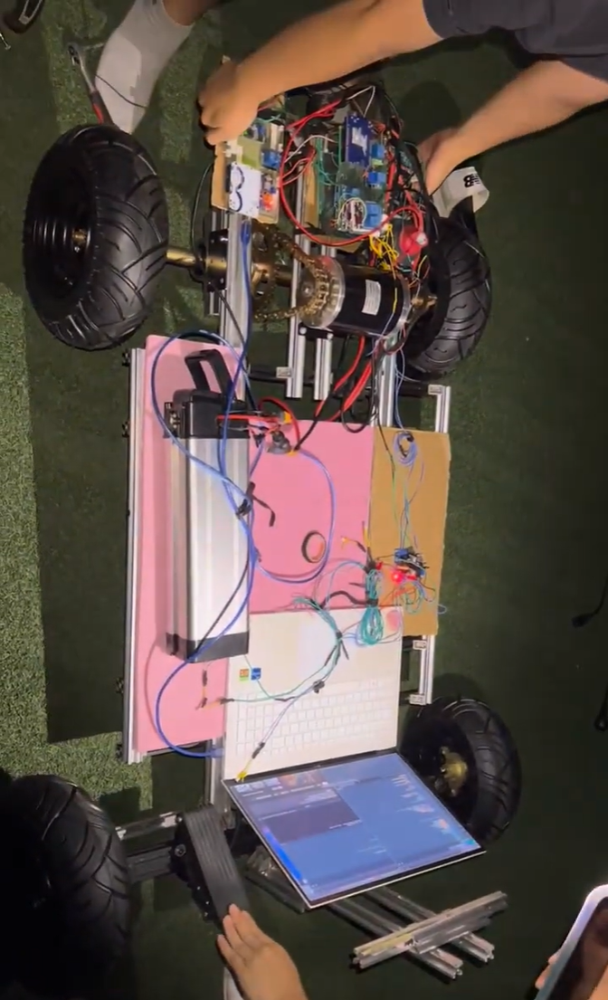
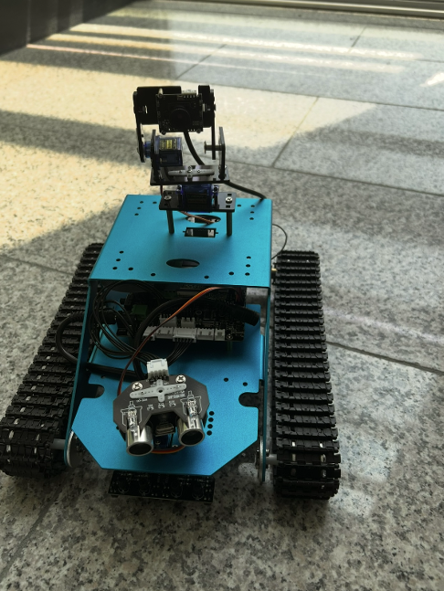
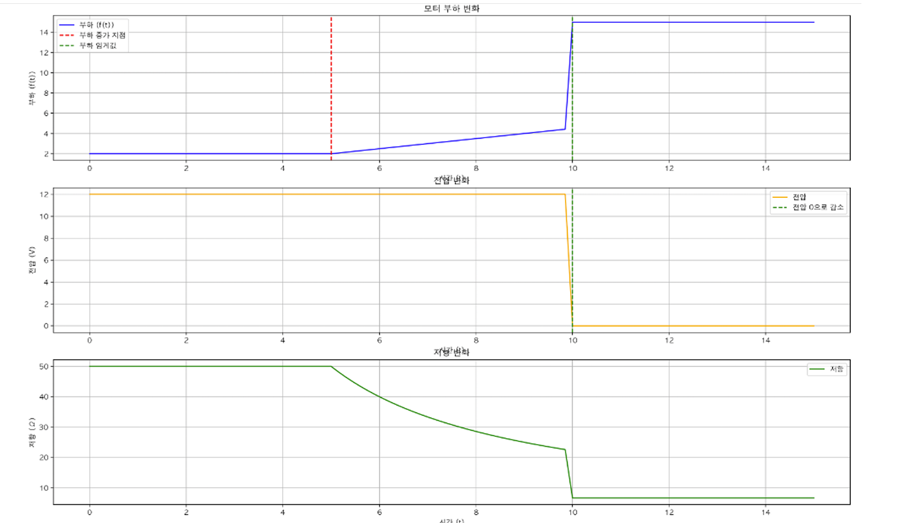
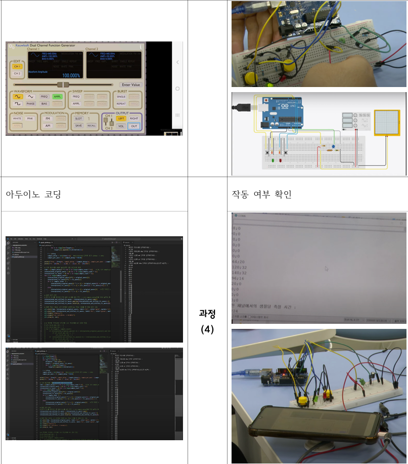
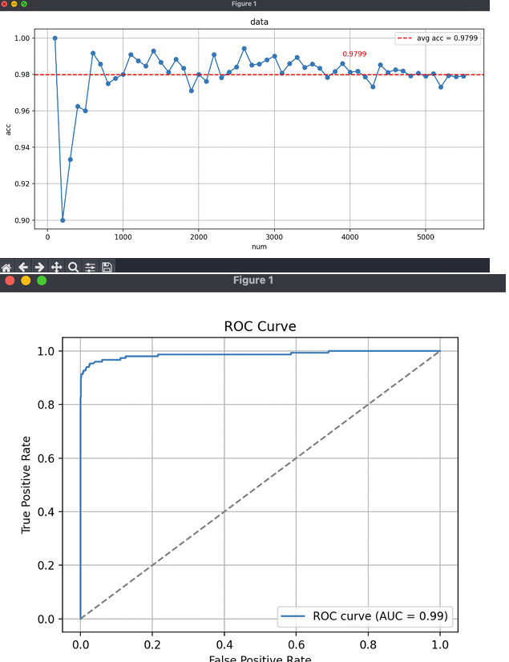

# 💫 About Me

### 📍 Academic Roadmap & Timeline
- 🏫 **2022 ~ 2025**: Unho HS (High School of SW & Science Specialized Curriculum)
- 🎓 **2026 ~ Present**: Undergraduate Student at Kumoh National Institute of Technology (KIT)
---

### 🧠 Fields of Interest
- **Embedded Systems**
- **Robotics**
- **Physical AI**
- **On-Device AI**
- **Edge Computing**
- **HRI**
- **SDV**

---

### 🏅 Awards & Certifications
- 🏆 **충북 컴퓨터 꿈나무 축제** 특상 - Chungbuk Computer Genius Festival (2022)
- 🏆 **Coding Online Festival** (1st Place) - Korea Ministry of Science and ICT (Part. C)
- 🎓 **code.org** Basic Concept Computer Science Completion (SW & Science Specialized HS)
- 🎓 **Google Ai course** (Google, 2026)
- 🎓 **Samsung Brightics AI Course** Completion (Chungbuk Education & Information Research Institute, 2023)
- 🎓 **경북게임개발사관학교 문제해결심화교육(Part. Unity 클라이언트 최적화, 비동기, 생산성 향상 기법)** Completion (경북테크노파크, 2026)
- 🎓 **Dale Carnegie Course** (Dale Carnegie & Associates, Inc., 2026)
- 📜 **COS Pro C** 2nd Class (YBM, 2024)
- 📜 **SQLD** (SQL Developer Certification, 2025)
- 📜 **빅데이터활용분석 2급** (Korea Human Resource Development iInstitute, 2026)

---

### 🛠 Tech Stacks & Tools

#### Languages & Frameworks

  
  
  
  
  
  

#### Embedded & Platforms

  
  
  

#### Operating Systems

  
  
  
  
  
  

#### Development Tools

  
  
  
  

---

### Highlighte project

 <b>Full-Scale Autonomous Vehicle Prototype (2024~2026)</b>

> **안전 최우선 제어기술을 적용한 1인승 탑승형 자율주행 자동차 구현**

  
  
  

### Completed Projects

 <b>Intelligent Companion Robot for Elderly Care</b>

> **HRI기반 독거노인 맞춤형 지능형 반려로봇 시스템 구현**

* **The Problem**: 고령화 사회 속 독거노인의 낙상 등 응급 상황 발생 시 골든타임 확보의 어려움과 정서적 고립감 문제 직면. 기존 단순 IoT 알림의 수동적 한계를 극복하고, 인간-로봇 상호작용(HRI) 및 무선망 능동 응급 관제 기능을 결합한 서비스 로봇의 필요성 대두.

  
  

 <b>Discontinuity-Based Motor Load Safety Device</b>

> **함수의 극한 및 불연속 신호 감지 기법을 이용한 모터 부하 과전류 예방 안전 장치 구현**

* **The Problem**: 모터 과부하 및 급격한 구동 방해 상황 발생 시, 기존 전류 임계값(Threshold) 기반의 차단기는 이미 전류가 한계치를 넘은 후 작동하여 전선과 배터리 관리 시스템(BMS)에 영구적인 물리적 손상을 입히는 시차(Time-lag) 보틀넥 발생.
* **Implementation**: 실시간 부하 수렴 추세를 측정하여 $\lim_{t \to t_0} f(t) \neq f(t_0)$ 형태의 미세 변동률 급증 구간인 **'불연속 지점(Discontinuity)'을 선제적으로 실시간 캡처**해내는 파이썬 시뮬레이션 알고리즘 구축.

  

📉 <b>Arduino-Based Oscilloscope & RLC Analyzer</b>

> **RLC 회로 실시간 위상차 분석 시스템 구현**

* **The Problem**: 고가의 전문 계측장비(오실로스코프, 함수발생기) 없이 저비용 아두이노와 스마트폰 오디오 신호 제어만으로 교류 RLC 회로의 위상 왜곡을 측정하려 했으나, 아두이노 하드웨어 내부 ADC 단일 컨버터가 채널 A0와 A1을 번갈아 가며 읽는 '순차 샘플링 지연(224$\mu s$)'으로 인해 데이터 계산상 치명적인 수학적 위상 왜곡 오차가 발생하는 한계 봉착.
* **Mathematical Solution**: 계측 데이터 배열을 소프트웨어단에서 가공하기 위해 미적분학 및 심화수학의 **선형보간법(Linear Interpolation)** 연산 알고리즘을 파이썬 처리 파이프라인 적용

  
  

✉️ <b>Naive Bayes Spam Classification Engine</b>

> **SMS 스팸 분류기 구현**

* **The Problem**: 텍스트 기반 메시지 분류 시, Train Set 에 한 번도 존재하지 않는 상태로 테스트셋에 등장하면, 오분류를 일으키는 베이지안 모델의 Zero-Probability Defect 결함 해결 필요.

  
  

---

### 📊 GitHub Stats

  
  

